# 🐧 Linux Boot Process Analysis

**🎯 Tujuan :** 
Mahasiswa diharapkan dapat memahami secara mendalam proses booting pada sistem operasi Linux, mulai dari tahap firmware hingga user space, serta mampu menganalisis setiap komponen yang terlibat dalam proses tersebut.

---

# 📋 Scope Pembahasan:

1. Analisis tahapan proses booting Linux secara komprehensif
2. Pembuatan flowchart detail untuk visualisasi proses boot
3. Identifikasi komponen kritis dalam setiap tahap
4. Troubleshooting umum yang terjadi pada proses booting

---

# 🔍 Linux Boot Process Overview 
Linux boot process adalah serangkaian tahapan sistematis yang dilakukan oleh sistem untuk memuat dan menjalankan kernel Linux serta komponen-komponen pendukungnya. Proses ini melibatkan interaksi antara firmware, bootloader, kernel, dan init system.

---

## 🗺️ Flowchart Proses Booting Linux:

```mermaid
graph TD
    A[💻 System Power On] --> B[🔧 BIOS/UEFI Initialization]
    B --> C{🔍 POST Check}
    C -->|✅ Success| D[⚙️ Hardware Detection & Init]
    C -->|❌ Failure| E[🚨 Hardware Error - Beep Codes]
    D --> F[🔍 Boot Device Selection]
    F --> G[📀 Load Bootloader from MBR/GPT]
    G --> H[🚀 GRUB Bootloader]
    H --> I{🎯 Boot Menu Selection}
    I -->|⏰ Timeout| J[🔄 Default Kernel Selection]
    I -->|👤 User Choice| J
    J --> K[📦 Load Kernel Image]
    K --> L[💾 Load initramfs/initrd]
    L --> M[🔓 Kernel Decompression]
    M --> N[🧠 Kernel Memory Setup]
    N --> O[🔧 Hardware Subsystem Init]
    O --> P[📁 Mount initramfs as Root]
    P --> Q[🔍 Load Critical Drivers]
    Q --> R[🗂️ Real Root Filesystem Detection]
    R --> S[🔄 Switch Root to Real FS]
    S --> T[🎯 Execute /sbin/init - PID 1]
    T --> U{🔧 Init System Type}
    U -->|systemd| V[🎯 systemd Target Processing]
    U -->|SysV| W[📊 SysV Runlevel Processing]
    U -->|OpenRC| X[⚡ OpenRC Service Management]
    V --> Y[🔄 Parallel Service Startup]
    W --> Z[📈 Sequential Service Startup]
    X --> AA[🚀 Dependency-based Startup]
    Y --> BB[🌐 Network Configuration]
    Z --> BB
    AA --> BB
    BB --> CC[🗂️ Mount Additional Filesystems]
    CC --> DD[🔧 System Service Initialization]
    DD --> EE{🖥️ Target Environment}
    EE -->|Text Mode| FF[📝 Getty Login Prompt]
    EE -->|Graphical| GG[🖼️ Display Manager]
    FF --> HH[🔐 User Authentication]
    GG --> HH
    HH --> II[🏠 User Session Started]
    II --> JJ[✨ System Ready for Use]
    
    style A fill:#e1f5fe
    style E fill:#ffebee
    style JJ fill:#e8f5e8
```



---

## 📊 Detailed Boot Process Analysis:

### 🔧 Phase 1: Firmware Stage (BIOS/UEFI)

| 🔢 Step | 🎯 Component | 📝 Process Description | ⏱️ Duration |
|---------|--------------|------------------------|-------------|
| **1** | **Power Supply** | Converts AC to DC, provides stable power to motherboard | 1-2 seconds |
| **2** | **BIOS/UEFI** | Firmware initialization, hardware inventory | 3-5 seconds |
| **3** | **POST** | Power-On Self Test - CPU, RAM, storage verification | 2-4 seconds |
| **4** | **Boot Priority** | Determines boot device order (HDD, SSD, USB, Network) | 1 second |

### 🚀 Phase 2: Bootloader Stage (GRUB)

| 🔢 Step | 🎯 Component | 📝 Process Description | 🔧 Configuration |
|---------|--------------|------------------------|------------------|
| **5** | **MBR/GPT** | Loads first 512 bytes containing bootloader code | `/dev/sda` |
| **6** | **GRUB Stage 1** | Minimal bootloader code execution | MBR sector |
| **7** | **GRUB Stage 2** | Full GRUB environment with menu capabilities | `/boot/grub/` |
| **8** | **Kernel Selection** | User selects kernel or default timeout occurs | `grub.cfg` |

### 🧠 Phase 3: Kernel Stage

| 🔢 Step | 🎯 Component | 📝 Process Description | 📁 Location |
|---------|--------------|------------------------|-------------|
| **9** | **Kernel Loading** | Compressed kernel image loaded into RAM | `/boot/vmlinuz-*` |
| **10** | **initramfs** | Initial RAM filesystem with essential drivers | `/boot/initramfs-*` |
| **11** | **Decompression** | Kernel self-extraction and initialization | Memory |
| **12** | **Hardware Init** | CPU, memory, interrupt controllers setup | Kernel space |
| **13** | **Driver Loading** | Essential drivers for storage and filesystems | initramfs |

### ⚙️ Phase 4: Init System Stage

| 🔢 Step | 🎯 Component | 📝 Process Description | 🔧 Modern Implementation |
|---------|--------------|------------------------|-----------------------|
| **14** | **PID 1 Process** | First userspace process starts | `systemd` |
| **15** | **Target/Runlevel** | Determines system operation mode | `multi-user.target` |
| **16** | **Service Startup** | System services and daemons initialization | Parallel execution |
| **17** | **Network Setup** | Network interfaces and connectivity | NetworkManager |
| **18** | **Filesystem Mount** | Additional partitions and network shares | `/etc/fstab` |

### 🖥️ Phase 5: User Space Stage

| 🔢 Step | 🎯 Component | 📝 Process Description | 🎨 Interface Type |
|---------|--------------|------------------------|-------------------|
| **19** | **Login Manager** | Authentication interface preparation | GDM/SDDM/LightDM |
| **20** | **User Session** | Desktop environment or shell initialization | GNOME/KDE/CLI |
| **21** | **Application Loading** | User applications and services startup | User preference |
| **22** | **System Ready** | Fully operational system state | Interactive mode |

---

## 🔧 Critical Boot Components:

### 🎯 systemd Boot Targets:
- **`emergency.target`** - Minimal system for troubleshooting
- **`rescue.target`** - Single-user mode with basic services
- **`multi-user.target`** - Full multi-user system without GUI
- **`graphical.target`** - Complete system with desktop environment

### 📦 Essential Boot Files:
- **`/boot/vmlinuz-*`** - Compressed kernel image
- **`/boot/initramfs-*`** - Initial RAM filesystem
- **`/boot/grub/grub.cfg`** - GRUB bootloader configuration
- **`/etc/fstab`** - Filesystem mount table
- **`/etc/systemd/system/`** - systemd unit files

### 🔍 Boot Logging:
- **`/var/log/boot.log`** - Boot process messages
- **`/var/log/kern.log`** - Kernel messages
- **`journalctl -b`** - systemd boot journal
- **`dmesg`** - Kernel ring buffer messages

---

## 🛠️ Common Boot Issues & Solutions:

### ❌ GRUB Bootloader Issues:
```bash
# Reinstall GRUB
sudo grub-install /dev/sda
sudo update-grub

# Manual GRUB repair
sudo mount /dev/sda2 /mnt
sudo mount --bind /dev /mnt/dev
sudo chroot /mnt
grub-install /dev/sda
```

### 🔧 Kernel Boot Parameters:
```
# Emergency boot options
init=/bin/bash          # Direct shell access
systemd.unit=rescue.target  # Rescue mode
ro recovery nomodeset   # Read-only, safe graphics
```

### 🔍 Boot Troubleshooting Commands:
```bash
# Check boot messages
journalctl -b -p err
dmesg | grep -i error

# Analyze boot time
systemd-analyze
systemd-analyze blame
systemd-analyze critical-chain
```

---

## 📚 Technical References:
- **Linux Boot Process Documentation** - kernel.org
- **systemd System and Service Manager** - freedesktop.org
- **GRUB Manual** - GNU.org
- **UEFI Specification** - uefi.org
- **Linux System Administrator's Guide** - TLDP.org

---

## 📋 Conclusion:
Proses booting Linux merupakan orkestra kompleks yang melibatkan firmware, bootloader, kernel, dan init system. Pemahaman mendalam terhadap setiap tahap memungkinkan administrator sistem untuk:

1. **🔧 Troubleshooting** - Mengidentifikasi dan mengatasi masalah boot
2. **⚡ Optimization** - Mengoptimalkan waktu startup sistem
3. **🛡️ Security** - Mengamankan proses boot dari ancaman keamanan
4. **🔄 Customization** - Menyesuaikan konfigurasi boot sesuai kebutuhan

Dengan flowchart dan analisis detail ini, diharapkan pemahaman tentang proses booting Linux menjadi lebih komprehensif dan praktis untuk implementasi di lingkungan produksi.

---

<div align="center">

**📞 Contact Information:**
- 📧 Email: [email@example.com]
- 🐙 GitHub: [github.com/username]
- 🌐 LinkedIn: [linkedin.com/in/username]

</div>
