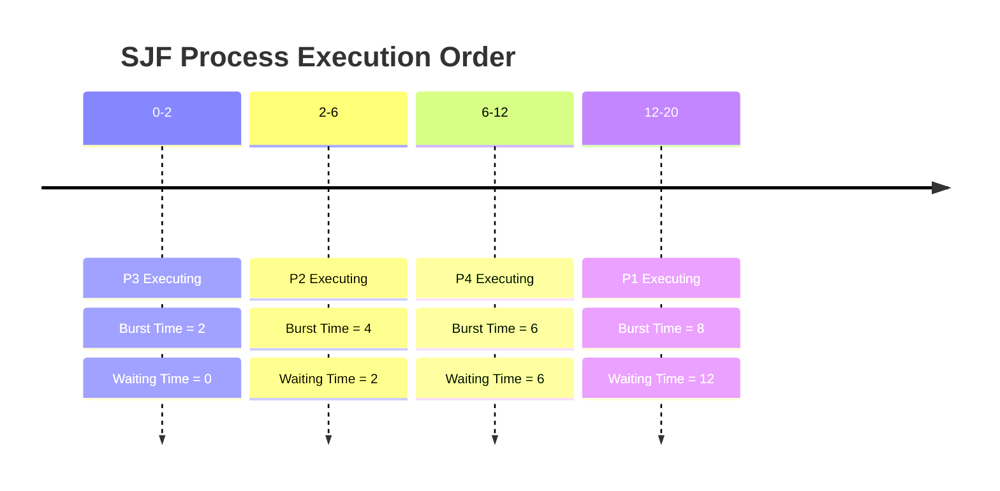

# Analisis SJF Scheduling Algorithm dan Gantt Chart

## Deskripsi Program

Program ini mengimplementasikan algoritma **Shortest Job First (SJF) Non-Preemptive** tanpa arrival time. Algoritma ini menjadwalkan proses berdasarkan burst time terpendek terlebih dahulu.

## Source Code

```c
#include<stdio.h>
struct proc
{
    int no,bt,ct,tat,wt;
};

struct proc read(int i)
{
    struct proc p;
    printf("\nProcess No: %d\n",i);
    p.no=i;
    printf("Enter Burst Time: ");
    scanf("%d",&p.bt);
    return p;
}

int main()
{
    struct proc p[10],tmp;
    float avgtat=0,avgwt=0;
    int n,ct=0;
    printf("<--SJF Scheduling Algorithm Without Arrival Time (Non-Preemptive)-->\n");
    printf("Enter Number of Processes: ");
    scanf("%d",&n);
    
    // Input burst time untuk setiap proses
    for(int i=0;i<n;i++)
        p[i]=read(i+1);
    
    // Sorting berdasarkan burst time (SJF)
    for(int i=0;i<n-1;i++)
        for(int j=0;j<n-i-1;j++)    
            if(p[j].bt>p[j+1].bt)
            {
                tmp=p[j];
                p[j]=p[j+1];
                p[j+1]=tmp;
            }
    
    // Kalkulasi dan output
    printf("\nProcessNo\tBT\tCT\tTAT\tWT\tRT\n");
    for(int i=0;i<n;i++)
    {
        ct+=p[i].bt;
        p[i].ct=p[i].tat=ct;
        avgtat+=p[i].tat;
        p[i].wt=p[i].tat-p[i].bt;
        avgwt+=p[i].wt;
        printf("P%d\t\t%d\t%d\t%d\t%d\t%d\n",p[i].no,p[i].bt,p[i].ct,p[i].tat,p[i].wt,p[i].wt);
    }
    avgtat/=n,avgwt/=n;
    printf("\nAverage TurnAroundTime=%f\nAverage WaitingTime=%f",avgtat,avgwt);
    return 0;
}
```

## Output Program

```
<--SJF Scheduling Algorithm Without Arrival Time (Non-Preemptive)-->
Enter Number of Processes: 4

Process No: 1
Enter Burst Time: 8

Process No: 2
Enter Burst Time: 4

Process No: 3
Enter Burst Time: 2

Process No: 4
Enter Burst Time: 6

ProcessNo	BT	CT	TAT	WT	RT
P3		2	2	2	0	0
P2		4	6	6	2	2
P4		6	12	12	6	6
P1		8	20	20	12	12

Average TurnAroundTime=10.000000
Average WaitingTime=5.000000
```

## Struktur Program

### 1. Struktur Data
```c
struct proc {
    int no;    // Nomor proses
    int bt;    // Burst Time
    int ct;    // Completion Time
    int tat;   // Turnaround Time
    int wt;    // Waiting Time
};
```

### 2. Fungsi Utama
- **`read(int i)`**: Membaca input burst time untuk setiap proses
- **Sorting**: Mengurutkan proses berdasarkan burst time menggunakan bubble sort
- **Kalkulasi**: Menghitung CT, TAT, dan WT untuk setiap proses

## Contoh Eksekusi

### Input Sample:
- **Jumlah Proses**: 4
- **Proses 1**: Burst Time = 8
- **Proses 2**: Burst Time = 4  
- **Proses 3**: Burst Time = 2
- **Proses 4**: Burst Time = 6

### Setelah Sorting (berdasarkan burst time):
| Proses | Burst Time | Urutan Eksekusi |
|--------|------------|-----------------|
| P3     | 2          | 1               |
| P2     | 4          | 2               |
| P4     | 6          | 3               |
| P1     | 8          | 4               |

### Perhitungan:

#### Proses P3 (BT=2):
- **CT** = 0 + 2 = 2
- **TAT** = CT - AT = 2 - 0 = 2
- **WT** = TAT - BT = 2 - 2 = 0

#### Proses P2 (BT=4):
- **CT** = 2 + 4 = 6
- **TAT** = CT - AT = 6 - 0 = 6
- **WT** = TAT - BT = 6 - 4 = 2

#### Proses P4 (BT=6):
- **CT** = 6 + 6 = 12
- **TAT** = CT - AT = 12 - 0 = 12
- **WT** = TAT - BT = 12 - 6 = 6

#### Proses P1 (BT=8):
- **CT** = 12 + 8 = 20
- **TAT** = CT - AT = 20 - 0 = 20
- **WT** = TAT - BT = 20 - 8 = 12

### Tabel Hasil:
| ProcessNo | BT | CT | TAT | WT | RT |
|-----------|----|----|-----|----|----|
| P3        | 2  | 2  | 2   | 0  | 0  |
| P2        | 4  | 6  | 6   | 2  | 2  |
| P4        | 6  | 12 | 12  | 6  | 6  |
| P1        | 8  | 20 | 20  | 12 | 12 |

### Rata-rata:
- **Average Turnaround Time** = (2 + 6 + 12 + 20) / 4 = **10.0**
- **Average Waiting Time** = (0 + 2 + 6 + 12) / 4 = **5.0**

## Gantt Chart (Mermaid)

```mermaid
gantt
    title SJF Scheduling Algorithm - Process Execution Timeline
    dateFormat X
    axisFormat %s
    
    section Process Execution
    P3 (BT=2)    :active, p3, 0, 2
    P2 (BT=4)    :active, p2, 2, 6
    P4 (BT=6)    :active, p4, 6, 12
    P1 (BT=8)    :active, p1, 12, 20
```



### Gantt Chart Timeline:


## Timeline Eksekusi:
- **0-2**: Proses P3 dieksekusi (Burst Time = 2)
- **2-6**: Proses P2 dieksekusi (Burst Time = 4)  
- **6-12**: Proses P4 dieksekusi (Burst Time = 6)
- **12-20**: Proses P1 dieksekusi (Burst Time = 8)

## Karakteristik SJF Non-Preemptive:

### Keunggulan:
- **Optimal** untuk meminimalkan average waiting time
- **Sederhana** dalam implementasi
- **Efisien** untuk batch systems

### Kelemahan:
- **Starvation**: Proses dengan burst time panjang bisa menunggu sangat lama
- **Sulit memprediksi** burst time yang akurat
- **Tidak responsif** untuk interactive systems

## Kompleksitas:
- **Time Complexity**: O(n²) untuk sorting (bubble sort)
- **Space Complexity**: O(n) untuk menyimpan array proses

## Catatan Penting:
1. Program ini mengasumsikan semua proses datang pada waktu yang sama (arrival time = 0)
2. Response Time (RT) sama dengan Waiting Time (WT) karena tidak ada arrival time
3. Algoritma ini optimal untuk minimasi average waiting time ketika arrival time sama
