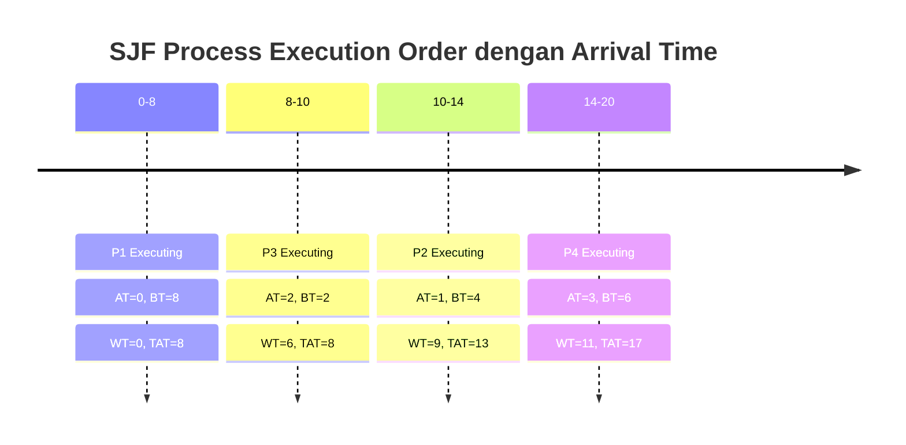

# Analisis Algoritma SJF Dengan Waktu Kedatangan (Non-Preemptive)

## Deskripsi Program

Program ini mengimplementasikan algoritma **Shortest Job First (SJF) Non-Preemptive** dengan arrival time. Algoritma ini menjadwalkan proses berdasarkan burst time terpendek yang sudah tiba (arrival time) pada waktu tertentu.

## Source Code

```c
#include<stdio.h>
struct proc
{
    int no,at,bt,it,ct,tat,wt;
};

struct proc read(int i)
{
    struct proc p;
    printf("\nProcess No: %d\n",i);
    p.no=i;
    printf("Enter Arrival Time: ");
    scanf("%d",&p.at);
    printf("Enter Burst Time: ");
    scanf("%d",&p.bt);
    return p;
}

int main()
{
    int  n,j,min=0;
    float avgtat=0,avgwt=0;
    struct proc p[10],temp;
    printf("<--SJF Scheduling Algorithm (Non-Preemptive)-->\n");
    printf("Enter Number of Processes: ");
    scanf("%d",&n);
    
    // Input arrival time dan burst time untuk setiap proses
    for(int i=0;i<n;i++)
        p[i]=read(i+1);
    
    // Sorting berdasarkan arrival time
    for(int i=0;i<n-1;i++)
        for(j=0;j<n-i-1;j++)    
            if(p[j].at>p[j+1].at)
            {
                temp=p[j];
                p[j]=p[j+1];
                p[j+1]=temp;
            }
    
    // Cari proses dengan burst time terpendek yang arrival time sama dengan proses pertama
    for(j=1;j<n&&p[j].at==p[0].at;j++)
        if(p[j].bt<p[min].bt)
            min=j;
    temp=p[0];
    p[0]=p[min];
    p[min]=temp;
    
    // Kalkulasi untuk proses pertama
    p[0].it=p[0].at;
    p[0].ct=p[0].it+p[0].bt;
    
    // Proses scheduling untuk proses selanjutnya
    for(int i=1;i<n;i++)
    {
        // Cari proses dengan burst time terpendek yang sudah tiba
        for(j=i+1,min=i;j<n&&p[j].at<=p[i-1].ct;j++)
            if(p[j].bt<p[min].bt)
                min=j;
        temp=p[i];
        p[i]=p[min];
        p[min]=temp;
        
        // Tentukan idle time dan completion time
        if(p[i].at<=p[i-1].ct)
            p[i].it=p[i-1].ct;
        else
            p[i].it=p[i].at;
        p[i].ct=p[i].it+p[i].bt;
    }
    
    // Output hasil
    printf("\nProcess\t\tAT\tBT\tCT\tTAT\tWT\tRT\n");
    for(int i=0;i<n;i++)
    {
        p[i].tat=p[i].ct-p[i].at;
        avgtat+=p[i].tat;
        p[i].wt=p[i].tat-p[i].bt;
        avgwt+=p[i].wt;
        printf("P%d\t\t%d\t%d\t%d\t%d\t%d\t%d\n",p[i].no,p[i].at,p[i].bt,p[i].ct,p[i].tat,p[i].wt,p[i].wt);
    }
    avgtat/=n,avgwt/=n;
    printf("\nAverage TurnAroundTime=%f\nAverage WaitingTime=%f",avgtat,avgwt);
    return 0;
}
```

## Output Program

```
<--SJF Scheduling Algorithm (Non-Preemptive)-->
Enter Number of Processes: 4

Process No: 1
Enter Arrival Time: 0
Enter Burst Time: 8

Process No: 2
Enter Arrival Time: 1
Enter Burst Time: 4

Process No: 3
Enter Arrival Time: 2
Enter Burst Time: 2

Process No: 4
Enter Arrival Time: 3
Enter Burst Time: 6

Process		AT	BT	CT	TAT	WT	RT
P1		0	8	8	8	0	0
P3		2	2	10	8	6	6
P2		1	4	14	13	9	9
P4		3	6	20	17	11	11

Average TurnAroundTime=11.500000
Average WaitingTime=6.500000
```

## Struktur Program

### 1. Struktur Data
```c
struct proc {
    int no;    // Nomor proses
    int at;    // Arrival Time
    int bt;    // Burst Time
    int it;    // Idle Time / Start Time
    int ct;    // Completion Time
    int tat;   // Turnaround Time
    int wt;    // Waiting Time
};
```

### 2. Algoritma Utama
1. **Input**: Baca arrival time dan burst time untuk setiap proses
2. **Sorting**: Urutkan berdasarkan arrival time
3. **SJF Selection**: Pilih proses dengan burst time terpendek yang sudah tiba
4. **Scheduling**: Jadwalkan proses secara berurutan
5. **Kalkulasi**: Hitung TAT, WT, dan rata-ratanya

## Contoh Eksekusi

### Input Sample:
| Proses | Arrival Time | Burst Time |
|--------|--------------|------------|
| P1     | 0            | 8          |
| P2     | 1            | 4          |
| P3     | 2            | 2          |
| P4     | 3            | 6          |

### Proses Scheduling:

#### Waktu 0:
- **Available**: P1 (AT=0, BT=8)
- **Selected**: P1 (satu-satunya yang tersedia)
- **Execution**: 0-8

#### Waktu 8:
- **Available**: P2 (AT=1, BT=4), P3 (AT=2, BT=2), P4 (AT=3, BT=6)
- **Selected**: P3 (burst time terpendek = 2)
- **Execution**: 8-10

#### Waktu 10:
- **Available**: P2 (AT=1, BT=4), P4 (AT=3, BT=6)
- **Selected**: P2 (burst time terpendek = 4)
- **Execution**: 10-14

#### Waktu 14:
- **Available**: P4 (AT=3, BT=6)
- **Selected**: P4 (satu-satunya yang tersisa)
- **Execution**: 14-20

### Perhitungan Detail:

#### Proses P1:
- **Start Time (IT)** = 0
- **Completion Time (CT)** = 0 + 8 = 8
- **Turnaround Time (TAT)** = 8 - 0 = 8
- **Waiting Time (WT)** = 8 - 8 = 0

#### Proses P3:
- **Start Time (IT)** = 8
- **Completion Time (CT)** = 8 + 2 = 10
- **Turnaround Time (TAT)** = 10 - 2 = 8
- **Waiting Time (WT)** = 8 - 2 = 6

#### Proses P2:
- **Start Time (IT)** = 10
- **Completion Time (CT)** = 10 + 4 = 14
- **Turnaround Time (TAT)** = 14 - 1 = 13
- **Waiting Time (WT)** = 13 - 4 = 9

#### Proses P4:
- **Start Time (IT)** = 14
- **Completion Time (CT)** = 14 + 6 = 20
- **Turnaround Time (TAT)** = 20 - 3 = 17
- **Waiting Time (WT)** = 17 - 6 = 11

### Tabel Hasil:
| Process | AT | BT | CT | TAT | WT | RT |
|---------|----|----|----|----|----|----|
| P1      | 0  | 8  | 8  | 8  | 0  | 0  |
| P3      | 2  | 2  | 10 | 8  | 6  | 6  |
| P2      | 1  | 4  | 14 | 13 | 9  | 9  |
| P4      | 3  | 6  | 20 | 17 | 11 | 11 |

### Rata-rata:
- **Average Turnaround Time** = (8 + 8 + 13 + 17) / 4 = **11.5**
- **Average Waiting Time** = (0 + 6 + 9 + 11) / 4 = **6.5**

## Gantt Chart (Mermaid)

```mermaid
gantt
    title SJF Scheduling Algorithm dengan Arrival Time - Process Execution Timeline
    dateFormat X
    axisFormat %s
    
    section Process Execution
    P1 (AT=0, BT=8)    :active, p1, 0, 8
    P3 (AT=2, BT=2)    :active, p3, 8, 10
    P2 (AT=1, BT=4)    :active, p2, 10, 14
    P4 (AT=3, BT=6)    :active, p4, 14, 20
```



### Gantt Chart Timeline:


## Timeline Eksekusi:
- **0-8**: Proses P1 dieksekusi (AT=0, BT=8)
- **8-10**: Proses P3 dieksekusi (AT=2, BT=2) - dipilih karena BT terpendek
- **10-14**: Proses P2 dieksekusi (AT=1, BT=4)
- **14-20**: Proses P4 dieksekusi (AT=3, BT=6)

## Perbedaan dengan SJF tanpa Arrival Time:

### SJF tanpa Arrival Time:
- Semua proses dianggap tiba pada waktu 0
- Sorting hanya berdasarkan burst time
- Lebih sederhana dalam implementasi

### SJF dengan Arrival Time:
- Mempertimbangkan waktu kedatangan proses
- Proses hanya bisa dipilih jika sudah tiba
- Lebih realistis untuk sistem nyata
- Algoritma lebih kompleks

## Karakteristik SJF Non-Preemptive dengan Arrival Time:

### Keunggulan:
- **Optimal** untuk meminimalkan average waiting time (dengan batasan arrival time)
- **Realistis** karena mempertimbangkan waktu kedatangan
- **Non-preemptive** sehingga tidak ada context switching di tengah eksekusi

### Kelemahan:
- **Starvation**: Proses dengan burst time panjang bisa menunggu sangat lama
- **Sulit memprediksi** burst time yang akurat
- **Convoy effect** bisa terjadi jika proses panjang menghalangi proses pendek

## Kompleksitas:
- **Time Complexity**: O(n²) untuk sorting dan selection
- **Space Complexity**: O(n) untuk menyimpan array proses

## Catatan Penting:
1. Program ini mempertimbangkan arrival time dalam pemilihan proses
2. Proses dipilih berdasarkan burst time terpendek dari yang sudah tiba
3. Response Time (RT) sama dengan Waiting Time (WT) karena non-preemptive
4. Idle time terjadi jika tidak ada proses yang tersedia pada suatu waktu
