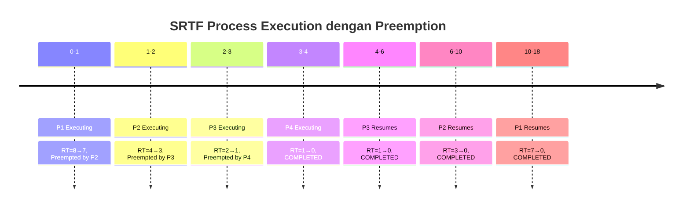

# Analisis Algoritma SRTF (Shortest Remaining Time First)

## Deskripsi Program

Program ini mengimplementasikan algoritma **Shortest Remaining Time First (SRTF)** yang merupakan versi preemptive dari SJF. Algoritma ini memilih proses dengan remaining time (sisa waktu) terpendek pada setiap unit waktu dan dapat melakukan preemption.

## Source Code

```c
#include<stdio.h>
#define MAX 9999

struct proc
{
    int no,at,bt,rt,ct,tat,wt;
};

struct proc read(int i)
{
    struct proc p;
    printf("\nProcess No: %d\n",i);
    p.no=i;
    printf("Enter Arrival Time: ");
    scanf("%d",&p.at);
    printf("Enter Burst Time: ");
    scanf("%d",&p.bt);
    p.rt=p.bt;  // Initialize remaining time dengan burst time
    return p;
}

int main()
{
    struct proc p[10],temp;
    float avgtat=0,avgwt=0;
    int n,s,remain=0,time;
    
    printf("<--SRTF Scheduling Algorithm (Preemptive)-->\n");
    printf("Enter Number of Processes: ");
    scanf("%d",&n);
    
    // Input arrival time dan burst time untuk setiap proses
    for(int i=0;i<n;i++)
        p[i]=read(i+1);
    
    // Sorting berdasarkan arrival time
    for(int i=0;i<n-1;i++)
        for(int j=0;j<n-i-1;j++)    
            if(p[j].at>p[j+1].at)
            {
                temp=p[j];
                p[j]=p[j+1];
                p[j+1]=temp;
            }
    
    printf("\nProcess\t\tAT\tBT\tCT\tTAT\tWT\n");
    p[9].rt=MAX;  // Sentinel value untuk perbandingan
    
    // Main scheduling loop - berjalan setiap unit waktu
    for(time=0;remain!=n;time++)
    {
        s=9;  // Index default (sentinel)
        
        // Cari proses dengan remaining time terpendek yang sudah tiba
        for(int i=0;i<n;i++)
            if(p[i].at<=time && p[i].rt<p[s].rt && p[i].rt>0)
                s=i;
        
        // Eksekusi proses terpilih selama 1 unit waktu
        p[s].rt--;
        
        // Jika proses selesai
        if(p[s].rt==0)
        {
            remain++;
            p[s].ct=time+1;
            p[s].tat=p[s].ct-p[s].at;
            avgtat+=p[s].tat;
            p[s].wt=p[s].tat-p[s].bt;
            avgwt+=p[s].wt;
            printf("P%d\t\t%d\t%d\t%d\t%d\t%d\n",p[s].no,p[s].at,p[s].bt,p[s].ct,p[s].tat,p[s].wt);
        }
    }
    
    avgtat/=n,avgwt/=n;
    printf("\nAverage TurnAroundTime=%f\nAverage WaitingTime=%f",avgtat,avgwt);
    return 0;
}
```

## Output Program

```
<--SRTF Scheduling Algorithm (Preemptive)-->
Enter Number of Processes: 4

Process No: 1
Enter Arrival Time: 0
Enter Burst Time: 8

Process No: 2
Enter Arrival Time: 1
Enter Burst Time: 4

Process No: 3
Enter Arrival Time: 2
Enter Burst Time: 2

Process No: 4
Enter Arrival Time: 3
Enter Burst Time: 1

Process		AT	BT	CT	TAT	WT
P4		3	1	4	1	0
P3		2	2	6	4	2
P2		1	4	10	9	5
P1		0	8	18	18	10

Average TurnAroundTime=8.000000
Average WaitingTime=4.250000
```

## Struktur Program

### 1. Struktur Data
```c
struct proc {
    int no;    // Nomor proses
    int at;    // Arrival Time
    int bt;    // Burst Time (original)
    int rt;    // Remaining Time (sisa waktu)
    int ct;    // Completion Time
    int tat;   // Turnaround Time
    int wt;    // Waiting Time
};
```

### 2. Algoritma SRTF
1. **Initialization**: Set remaining time = burst time untuk setiap proses
2. **Time Loop**: Untuk setiap unit waktu (0, 1, 2, ...)
3. **Selection**: Pilih proses dengan remaining time terpendek yang sudah tiba
4. **Execution**: Eksekusi proses selama 1 unit waktu (rt--)
5. **Completion Check**: Jika rt = 0, hitung CT, TAT, WT
6. **Preemption**: Proses dapat di-preempt kapan saja

## Contoh Eksekusi

### Input Sample:
| Proses | Arrival Time | Burst Time | Remaining Time |
|--------|--------------|------------|----------------|
| P1     | 0            | 8          | 8              |
| P2     | 1            | 4          | 4              |
| P3     | 2            | 2          | 2              |
| P4     | 3            | 1          | 1              |

### Trace Eksekusi Langkah demi Langkah:

| Time | Available Processes | Selected | Remaining Times | Action |
|------|-------------------|----------|-----------------|---------|
| 0    | P1(rt=8)          | P1       | P1=7           | Execute P1 |
| 1    | P1(rt=7), P2(rt=4)| P2       | P1=7, P2=3     | Preempt P1, Execute P2 |
| 2    | P1(rt=7), P2(rt=3), P3(rt=2) | P3 | P1=7, P2=3, P3=1 | Preempt P2, Execute P3 |
| 3    | P1(rt=7), P2(rt=3), P3(rt=1), P4(rt=1) | P4 | P1=7, P2=3, P3=1, P4=0 | Preempt P3, Execute P4 |
| 4    | P1(rt=7), P2(rt=3), P3(rt=1) | P3 | P1=7, P2=3, P3=0 | P4 selesai, Execute P3 |
| 5    | P1(rt=7), P2(rt=3) | P2       | P1=7, P2=2     | P3 selesai, Execute P2 |
| 6    | P1(rt=7), P2(rt=2) | P2       | P1=7, P2=1     | Execute P2 |
| 7    | P1(rt=7), P2(rt=1) | P2       | P1=7, P2=0     | Execute P2 |
| 8    | P1(rt=7)          | P1       | P1=6           | P2 selesai, Execute P1 |
| 9    | P1(rt=6)          | P1       | P1=5           | Execute P1 |
| 10   | P1(rt=5)          | P1       | P1=4           | Execute P1 |
| 11   | P1(rt=4)          | P1       | P1=3           | Execute P1 |
| 12   | P1(rt=3)          | P1       | P1=2           | Execute P1 |
| 13   | P1(rt=2)          | P1       | P1=1           | Execute P1 |
| 14   | P1(rt=1)          | P1       | P1=0           | Execute P1 |
| 15   | -                 | -        | -              | P1 selesai, All done |

### Perhitungan Detail:

#### Proses P4 (selesai di waktu 4):
- **Completion Time (CT)** = 4
- **Turnaround Time (TAT)** = 4 - 3 = 1
- **Waiting Time (WT)** = 1 - 1 = 0

#### Proses P3 (selesai di waktu 6):
- **Completion Time (CT)** = 6
- **Turnaround Time (TAT)** = 6 - 2 = 4
- **Waiting Time (WT)** = 4 - 2 = 2

#### Proses P2 (selesai di waktu 10):
- **Completion Time (CT)** = 10
- **Turnaround Time (TAT)** = 10 - 1 = 9
- **Waiting Time (WT)** = 9 - 4 = 5

#### Proses P1 (selesai di waktu 18):
- **Completion Time (CT)** = 18
- **Turnaround Time (TAT)** = 18 - 0 = 18
- **Waiting Time (WT)** = 18 - 8 = 10

### Tabel Hasil:
| Process | AT | BT | CT | TAT | WT |
|---------|----|----|----|----|-----|
| P4      | 3  | 1  | 4  | 1  | 0   |
| P3      | 2  | 2  | 6  | 4  | 2   |
| P2      | 1  | 4  | 10 | 9  | 5   |
| P1      | 0  | 8  | 18 | 18 | 10  |

### Rata-rata:
- **Average Turnaround Time** = (1 + 4 + 9 + 18) / 4 = **8.0**
- **Average Waiting Time** = (0 + 2 + 5 + 10) / 4 = **4.25**

## Gantt Chart (Mermaid)

```mermaid
gantt
    title SRTF Scheduling Algorithm - Process Execution Timeline (Preemptive)
    dateFormat X
    axisFormat %s
    
    section Process Execution
    P1 (0-1)     :active, p1a, 0, 1
    P2 (1-2)     :active, p2a, 1, 2
    P3 (2-3)     :active, p3a, 2, 3
    P4 (3-4)     :active, p4, 3, 4
    P3 (4-6)     :active, p3b, 4, 6
    P2 (6-10)    :active, p2b, 6, 10
    P1 (10-18)   :active, p1b, 10, 18
```



### Gantt Chart Timeline Detail:


## Timeline Eksekusi dengan Preemption:
- **0-1**: P1 dieksekusi (RT: 8→7)
- **1-2**: P2 preempt P1, dieksekusi (RT: 4→3)
- **2-3**: P3 preempt P2, dieksekusi (RT: 2→1)
- **3-4**: P4 preempt P3, dieksekusi sampai selesai (RT: 1→0) ✓
- **4-6**: P3 resume, dieksekusi sampai selesai (RT: 1→0) ✓
- **6-10**: P2 resume, dieksekusi sampai selesai (RT: 3→0) ✓
- **10-18**: P1 resume, dieksekusi sampai selesai (RT: 7→0) ✓

## Perbandingan dengan Algoritma Lain:

### SRTF vs SJF (Non-Preemptive):
| Metric | SRTF | SJF dengan AT |
|--------|------|---------------|
| Average TAT | 8.0 | 11.5 |
| Average WT | 4.25 | 6.5 |
| Preemption | Ya | Tidak |
| Context Switching | Tinggi | Rendah |

### Keunggulan SRTF:
- **Optimal** untuk meminimalkan average waiting time
- **Responsif** terhadap proses pendek yang datang
- **Mengurangi starvation** dibanding FCFS

### Kelemahan SRTF:
- **Context switching overhead** yang tinggi
- **Kompleksitas implementasi** lebih tinggi
- **Starvation** masih mungkin terjadi untuk proses panjang
- **Sulit memprediksi** remaining time yang akurat

## Karakteristik SRTF:

### Preemption Policy:
- Proses bisa di-preempt setiap saat
- Keputusan scheduling dibuat setiap unit waktu
- Proses dengan remaining time terpendek diprioritaskan

### Kompleksitas:
- **Time Complexity**: O(n × total_time) untuk simulasi
- **Space Complexity**: O(n) untuk menyimpan proses
- **Context Switching**: O(preemption_count)
