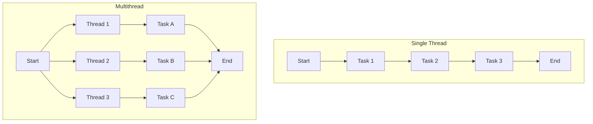

# Konsep Single Thread dan Multithread

## Pengertian

**Single Thread** adalah model eksekusi program di mana hanya satu urutan instruksi yang dapat dijalankan pada satu waktu. Dalam model ini, tugas-tugas dijalankan secara sekuensial, yang berarti setiap tugas harus menunggu hingga tugas sebelumnya selesai dieksekusi. Seperti seorang pekerja tunggal yang harus menyelesaikan satu pekerjaan sebelum memulai pekerjaan lainnya, single thread menawarkan kesederhanaan tetapi dapat menyebabkan program terasa lambat terutama ketika berhadapan dengan tugas yang membutuhkan waktu pemrosesan lama atau operasi input/output yang intensif.

**Multithread** adalah model eksekusi program di mana beberapa urutan instruksi (thread) dapat dijalankan secara bersamaan. Model ini memungkinkan pemecahan suatu program menjadi beberapa bagian yang dapat dieksekusi secara paralel, masing-masing thread menangani tugas tertentu secara independen namun masih berbagi sumber daya yang sama. Seperti tim pekerja yang bekerja secara bersamaan pada proyek yang berbeda-beda, multithread meningkatkan kinerja program dengan memanfaatkan kemampuan pemrosesan paralel dari CPU modern, mengurangi waktu tunggu, dan meningkatkan responsivitas program secara keseluruhan.

## Visualisasi

## Perbandingan

| Aspek | Single Thread | Multithread |
|-------|--------------|-------------|
| Eksekusi | Sekuensial | Paralel |
| Kompleksitas | Sederhana | Lebih kompleks |
| Pemanfaatan CPU | Terbatas | Optimal |
| Responsivitas | Lebih rendah | Lebih tinggi |
| Penggunaan memori | Lebih efisien | Memerlukan lebih banyak memori |
| Sinkronisasi | Tidak diperlukan | Diperlukan untuk koordinasi antar thread |

## Keuntungan dan Kerugian

### Single Thread

**Keuntungan:**
- Implementasi yang lebih sederhana
- Tidak memerlukan mekanisme sinkronisasi
- Kebutuhan memori yang lebih rendah
- Tidak ada overhead untuk manajemen thread

**Kerugian:**
- Pemborosan sumber daya CPU pada sistem multicore
- Aplikasi dapat "hang" jika terjadi operasi yang berat
- Tidak dapat memanfaatkan komputasi paralel
- Responsivitas aplikasi menurun saat menangani tugas yang berat

### Multithread

**Keuntungan:**
- Meningkatkan responsivitas aplikasi
- Pemanfaatan CPU yang lebih efisien
- Berbagi sumber daya antar thread
- Mampu menjalankan beberapa tugas secara bersamaan

**Kerugian:**
- Kompleksitas pemrograman meningkat
- Potensi deadlocks dan race conditions
- Overhead dari manajemen thread dan sinkronisasi
- Debugging yang lebih sulit
